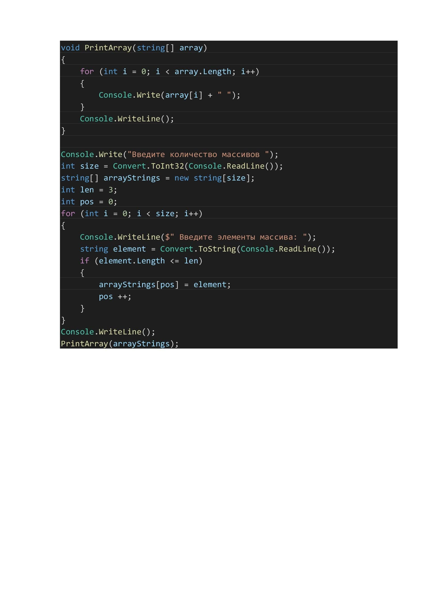

Итоговое задание: *Написать программу, которая из имеющегося массива строк формирует массив из строк, длина которых меньше либо равна 3 символам.*

Блок схема алгоритма:

Код алгоритма:Итоговое задание: *Написать программу, которая из имеющегося массива строк формирует массив из строк, длина ко

